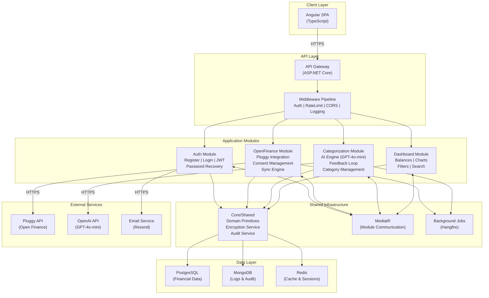

# System Architecture: Motor Financeiro

**Date:** 2026-03-03
**Architect:** rafael.giovannini
**Version:** 1.0
**Project Type:** SaaS Web App (backend preparado para separação futura)
**Project Level:** 2 (Medium)
**Status:** Draft

---

## Document Overview

This document defines the system architecture for Motor Financeiro. It provides the technical blueprint for implementation, addressing all functional and non-functional requirements from the PRD.

**Related Documents:**
- Product Requirements Document: `docs/prd-motor-financeiro-2026-03-03.md`
- Product Brief: `docs/product-brief-motor-financeiro-2026-03-03.md`

---

## Executive Summary

Motor Financeiro é um SaaS de gestão financeira pessoal que se conecta a instituições financeiras brasileiras via Open Finance (através da Pluggy) para capturar movimentações em tempo real e categorizá-las automaticamente usando IA (GPT-4o-mini). O sistema segue uma arquitetura **Modular Monolith com Clean Architecture**, priorizando **segurança desde o dia 1** como driver arquitetural principal. O backend é construído em **.NET 10** com **PostgreSQL** (dados financeiros estruturados) e **MongoDB** (logs/auditoria), e o frontend em **Angular + TypeScript**. Deploy via **Docker** em VPS (Hostinger).

---

## Architectural Drivers

Estes requisitos não-funcionais influenciam decisivamente as decisões de design:

1. **NFR-004/005/018 — Encriptação Total (Repouso + Trânsito + Tokens)**
   - Requer: AES-256 para dados em repouso, TLS 1.3 em trânsito, vault para segredos
   - Impacto: Camada de encryption middleware, key management dedicado

2. **NFR-007 — Autenticação Segura**
   - Requer: JWT com expiração curta (15-30min), refresh token rotation, rate limiting, Argon2
   - Impacto: Auth module robusto com token lifecycle management

3. **NFR-019 — Isolamento de Dados por Usuário**
   - Requer: UUIDs, filtro por user_id em todas as queries, validação de ownership
   - Impacto: Row-level security, middleware de tenant isolation

4. **NFR-006 — Conformidade LGPD**
   - Requer: Exportação de dados, exclusão completa, consentimento explícito
   - Impacto: Soft delete, data portability endpoints, audit trail

5. **NFR-012 — Resiliência de Integrações**
   - Requer: Retry com backoff exponencial, circuit breaker, graceful degradation
   - Impacto: Polly para resilience, background job queue, cache de fallback

6. **NFR-015 — Cobertura de Testes 90%**
   - Requer: Arquitetura altamente testável
   - Impacto: Dependency injection, interfaces, Clean Architecture com camadas desacopladas

7. **NFR-016/017 — Logging Estruturado + Auditoria Imutável**
   - Requer: JSON structured logging, correlation ID, append-only audit log
   - Impacto: Cross-cutting middleware, MongoDB para logs, Serilog

8. **NFR-001/002 — Performance**
   - Requer: API <500ms p95, dashboard <3s
   - Impacto: Redis cache, query optimization, lazy loading no frontend

---

## System Overview

### High-Level Architecture

**Pattern:** Modular Monolith com Clean Architecture

O sistema é organizado em módulos por domínio de negócio (bounded contexts), cada um com suas próprias camadas (Domain, Application, Infrastructure). Os módulos se comunicam via interfaces internas (mediator pattern) dentro de um único deployment unit.

**Módulos Principais:**
1. **API Gateway Layer** — Entry point unificado, auth middleware, rate limiting, CORS
2. **Auth Module** — Registro, login, JWT, refresh tokens, password recovery
3. **OpenFinance Module** — Integração Pluggy, consentimentos, sincronização de contas/transações
4. **Categorization Module** — Motor IA (GPT-4o-mini), feedback loop, gestão de categorias
5. **Dashboard Module** — Saldos consolidados, gráficos, filtros, busca, detalhamento
6. **Core/Shared** — Domain primitives, encryption, logging, audit, error handling

**Interação:**
```
Angular SPA → API Gateway → [Auth Module]
                          → [OpenFinance Module] → Pluggy API
                          → [Categorization Module] → GPT-4o-mini API
                          → [Dashboard Module]
                          → [Core/Shared] → PostgreSQL / MongoDB / Redis
```

### Architecture Diagram



### Architectural Pattern

**Pattern:** Modular Monolith com Clean Architecture

**Rationale:** Para um projeto Level 2 com desenvolvedor solo, microserviços trariam complexidade operacional desnecessária (networking, service discovery, distributed transactions). O Modular Monolith oferece:
- **Simplicidade de deploy** — um container, um processo
- **Fronteiras claras** — cada módulo é um bounded context isolado
- **Testabilidade** — Clean Architecture com DI permite testes unitários e integração sem infraestrutura
- **Preparação para futuro** — módulos podem ser extraídos para microserviços quando a escala justificar (Fase 3)
- **Performance** — comunicação in-process é ordens de magnitude mais rápida que HTTP entre serviços

---

## Technology Stack

### Frontend

**Choice:** Angular 19+ com TypeScript

**Rationale:**
- Framework opinionated com estrutura clara — produtividade para desenvolvedor solo
- Módulos/standalone components facilitam organização por feature
- Angular Material + CDK para UI consistente
- Integração nativa com RxJS para dados real-time (WebSocket/SSE para sync status)
- Ecossistema robusto para gráficos (ng2-charts/ngx-charts baseados em D3.js)
- TypeScript strict mode garante type safety end-to-end com DTOs do backend

**Trade-offs:**
- (+) Estrutura opinionated reduz decisões de design para dev solo
- (+) CLI poderoso para geração de código (ng generate)
- (-) Bundle size maior que React/Svelte (mitigado com lazy loading)
- (-) Learning curve mais íngreme (mas dev já escolheu Angular)

**Bibliotecas Principais:**
| Lib | Função |
|-----|--------|
| Angular Material | UI components, tema, responsividade |
| ngx-charts ou ng2-charts | Gráficos (pizza, barras, linhas) |
| NgRx / Signals | State management |
| Angular HTTP Client | Comunicação API com interceptors |
| angular-auth-oidc-client | Gerenciamento JWT no frontend |

### Backend

**Choice:** .NET 10 (ASP.NET Core) com C#

**Rationale:**
- .NET 10 é LTS (Nov 2025), estável para produção em 2026
- Performance excepcional (top 10 TechEmpower benchmarks)
- Clean Architecture bem estabelecida no ecossistema .NET (MediatR, FluentValidation)
- Entity Framework Core 10 para PostgreSQL com migrations
- ASP.NET Core Controllers (`[ApiController]`) para todos os endpoints — padrão único e consistente
- Ecossistema maduro de segurança (ASP.NET Identity, Data Protection API)

**Trade-offs:**
- (+) Performance, type safety, ecossistema rico
- (+) Tooling excelente (Rider/VS, hot reload, analyzers)
- (-) Overhead de boilerplate em Clean Architecture (mitigado com source generators)

**Bibliotecas Principais:**
| Lib | Função |
|-----|--------|
| MediatR | CQRS / Module communication |
| FluentValidation | Validação de inputs |
| Entity Framework Core 10 | ORM para PostgreSQL |
| MongoDB.Driver | Driver MongoDB |
| Serilog | Structured logging (JSON) |
| Polly | Resilience (retry, circuit breaker) |
| Hangfire | Background jobs (sync, categorização) |
| StackExchange.Redis | Cache distribuído |
| Mapster ou AutoMapper | Object mapping (DTO ↔ Domain) |
| Swashbuckle/NSwag | OpenAPI/Swagger docs |
| Argon2 (Konscious.Security) | Password hashing |

### Database

**Choice:** PostgreSQL 17 (dados financeiros) + MongoDB 8 (logs/auditoria)

**PostgreSQL — Dados Financeiros Estruturados:**
- Transações financeiras são altamente relacionais e estruturadas
- ACID compliance essencial para integridade financeira
- Row-Level Security (RLS) nativo para isolamento por usuário
- Full-text search para busca em transações (FR-018)
- Suporte a JSON/JSONB para dados semi-estruturados quando necessário
- Extensão pgcrypto para encryption at rest no nível de coluna

**MongoDB — Logs e Auditoria:**
- Schema-less ideal para logs estruturados com campos variáveis
- Append-only collections para audit trail imutável (NFR-017)
- TTL indexes para rotação automática de logs (NFR-016)
- Write-heavy workload separado do banco principal
- Capped collections para logs operacionais

**Trade-offs:**
- (+) Cada banco otimizado para seu workload
- (+) Isolamento de performance (queries de log não impactam dados financeiros)
- (-) Dois bancos para gerenciar (mitigado: ambos têm Docker images oficiais)

### Infrastructure

**Choice:** Docker Compose + VPS (Hostinger)

**Rationale:**
- Docker Compose encapsula toda a stack em um `docker-compose.yml`
- Hostinger VPS oferece bom custo-benefício para Fase 1 (pessoal)
- Cloud-agnostic: pode migrar para Azure/AWS sem mudar a aplicação
- Mínimo overhead operacional para desenvolvedor solo

**Componentes de Infra:**
| Container | Imagem | Porta | Recurso Estimado |
|-----------|--------|-------|-----------------|
| motor-api | Custom (.NET 10) | 5000 | 512MB RAM |
| motor-spa | nginx + Angular build | 80/443 | 128MB RAM |
| postgres | postgres:17-alpine | 5432 | 512MB RAM |
| mongodb | mongo:8 | 27017 | 256MB RAM |
| redis | redis:7-alpine | 6379 | 128MB RAM |
| **Total Estimado** | | | **~1.5GB RAM** |

**VPS Recomendado:** Hostinger KVM 2 (8GB RAM, 2 vCPU) — sobra margem para picos.

### Third-Party Services

| Serviço | Provider | Função | Custo Estimado (Fase 1) |
|---------|----------|--------|------------------------|
| Open Finance | Pluggy | Conexão bancária, consentimentos, transações | Free tier (dev) / ~$30/mês (prod) |
| IA Categorização | OpenAI (GPT-4o-mini) | Classificação de transações | ~$5/mês (volume pessoal) |
| Email | Resend | Confirmação, recuperação de senha | Free tier (100 emails/dia) |
| DNS/SSL | Cloudflare | DNS, CDN, SSL automático, WAF básico | Free tier |

**Nota sobre IA:** A interface de categorização é abstraída via Strategy Pattern (`ICategorizer`). GPT-4o-mini é o provider padrão. Se houver hardware disponível futuramente, Ollama pode ser plugado sem mudar código de negócio.

### Development & Deployment

| Ferramenta | Função |
|------------|--------|
| Git + GitHub | Version control, code review |
| GitHub Actions | CI/CD pipeline |
| Docker + Docker Compose | Containerização e orquestração local |
| xUnit + FluentAssertions | Testes unitários e integração (.NET) |
| Testcontainers | Testes de integração com DB real |
| Jasmine + Karma / Jest | Testes frontend Angular |
| Cypress ou Playwright | Testes E2E |
| Swagger/OpenAPI | Documentação API |
| SonarQube (opcional) | Análise estática de código |

---

## System Components

### Component 1: API Gateway Layer

**Purpose:** Entry point único para todas as requisições do frontend.

**Responsibilities:**
- Roteamento de requisições para módulos internos
- Middleware de autenticação (JWT validation)
- Rate limiting (sliding window por IP e por user)
- CORS configuration
- Request/Response logging (correlation ID)
- Global exception handling
- Request validation pipeline (FluentValidation)
- API versioning (/api/v1/...)

**Interfaces:**
- REST API via HTTPS (porta 443 via reverse proxy nginx)
- WebSocket (opcional, para notificações real-time de sync)

**Dependencies:**
- Auth Module (token validation)
- Todos os módulos internos (routing)
- Redis (rate limiting counters)

**FRs Addressed:** Todos (ponto de entrada universal)

---

### Component 2: Auth Module

**Purpose:** Autenticação, autorização e gestão do ciclo de vida do usuário.

**Responsibilities:**
- Registro de usuários com validação de email
- Login com JWT (access token + refresh token)
- Refresh token rotation (detect reuse → revoke family)
- Password recovery (token temporário via email)
- Password hashing (Argon2id)
- Rate limiting de login (5 tentativas/min/IP)
- Gestão de perfil e preferências
- Exclusão de conta (LGPD - direito ao esquecimento)

**Interfaces:**
- `POST /api/v1/auth/register`
- `POST /api/v1/auth/login`
- `POST /api/v1/auth/refresh`
- `POST /api/v1/auth/logout`
- `POST /api/v1/auth/forgot-password`
- `POST /api/v1/auth/reset-password`
- `GET/PATCH /api/v1/users/me`
- `DELETE /api/v1/users/me`

**Dependencies:**
- PostgreSQL (users, refresh_tokens)
- Redis (rate limiting, blacklisted tokens)
- Email Service (confirmação, recovery)
- Core/Shared (encryption, audit)

**FRs Addressed:** FR-001, FR-002, FR-003, FR-020, FR-021

---

### Component 3: OpenFinance Module

**Purpose:** Integração com instituições financeiras brasileiras via Pluggy API.

**Responsibilities:**
- Listar instituições financeiras suportadas
- Iniciar fluxo de consentimento OAuth (redirect para Pluggy)
- Armazenar e gerenciar consentimentos (ativo, expirado, revogado)
- Sincronizar contas bancárias (saldos, tipos)
- Sincronizar transações (deduplicação por hash)
- Agendamento de sync automática (Hangfire, a cada 6h)
- Sync manual sob demanda
- Alertas de consentimento próximo de expirar
- Importação manual de OFX/CSV (fallback)
- Retry com backoff exponencial + circuit breaker (Polly)

**Interfaces:**
- `GET /api/v1/institutions` (lista instituições)
- `POST /api/v1/connections` (iniciar consentimento)
- `GET /api/v1/connections` (listar conexões)
- `DELETE /api/v1/connections/{id}` (revogar)
- `POST /api/v1/connections/{id}/renew` (renovar)
- `GET /api/v1/accounts` (contas conectadas)
- `POST /api/v1/sync` (sync manual)
- `GET /api/v1/sync/history` (histórico de syncs)
- `POST /api/v1/import` (upload OFX/CSV)

**Dependencies:**
- Pluggy API (externa)
- PostgreSQL (connections, accounts, transactions)
- Hangfire (background sync jobs)
- Core/Shared (encryption de tokens, audit, resilience)

**FRs Addressed:** FR-004, FR-005, FR-006, FR-007, FR-008

---

### Component 4: Categorization Module

**Purpose:** Motor de classificação automática de transações por categoria usando IA.

**Responsibilities:**
- Categorizar transações novas automaticamente via GPT-4o-mini
- Registrar nível de confiança da classificação
- Marcar transações de baixa confiança para revisão
- Permitir correção manual de categoria
- Feedback loop: armazenar correções para aprendizado
- Regras baseadas em correções (N correções consistentes → regra)
- Gestão de categorias (CRUD, padrão + customizadas)
- Batch categorization via Hangfire (após sync)

**Interfaces:**
- `GET /api/v1/categories` (listar categorias)
- `POST /api/v1/categories` (criar custom)
- `PATCH /api/v1/categories/{id}` (editar)
- `DELETE /api/v1/categories/{id}` (excluir)
- `PATCH /api/v1/transactions/{id}/category` (correção manual)
- `POST /api/v1/transactions/{id}/apply-similar` (aplicar a similares)

**Dependencies:**
- OpenAI API / GPT-4o-mini (externa)
- PostgreSQL (categories, categorization_rules, corrections)
- Hangfire (batch categorization job)
- Core/Shared (audit)

**FRs Addressed:** FR-009, FR-010, FR-011, FR-012

---

### Component 5: Dashboard Module

**Purpose:** Consolidação e visualização de dados financeiros.

**Responsibilities:**
- Calcular saldo consolidado (todas as contas)
- Calcular saldo individual por conta
- Listar transações com paginação e filtros
- Filtro por período (predefinido e customizado)
- Filtro por conta bancária
- Filtro por categoria
- Busca full-text em transações
- Agregações para gráficos (gastos por categoria, tendências)
- Detalhamento de transação individual
- Comparativo mensal

**Interfaces:**
- `GET /api/v1/dashboard/summary` (saldos consolidados)
- `GET /api/v1/transactions` (lista paginada com filtros)
- `GET /api/v1/transactions/{id}` (detalhe)
- `GET /api/v1/dashboard/spending-by-category` (gráfico pizza/barras)
- `GET /api/v1/dashboard/trends` (tendência mensal)
- `GET /api/v1/dashboard/comparison` (mês atual vs anterior)

**Dependencies:**
- PostgreSQL (queries agregadas)
- Redis (cache de dashboard summaries)
- Core/Shared (logging)

**FRs Addressed:** FR-013, FR-014, FR-015, FR-016, FR-017, FR-018, FR-019

---

### Component 6: Core/Shared

**Purpose:** Infraestrutura transversal compartilhada por todos os módulos.

**Responsibilities:**
- Domain primitives (Money, Email, UserId como value objects)
- Encryption service (AES-256 para dados sensíveis)
- Audit service (log imutável de ações)
- Structured logging (Serilog + correlation ID)
- Error handling (Result pattern, ProblemDetails)
- Base repository interfaces
- Event bus (MediatR notifications entre módulos)
- Secret masking em logs

**Interfaces:**
- `IEncryptionService` — Encrypt/Decrypt de strings sensíveis
- `IAuditService` — LogAction com contexto (who, what, when, where)
- `ICategorizer` — Strategy pattern para provider de IA
- `ICurrentUser` — Contexto do usuário autenticado (user_id, roles)

**Dependencies:**
- PostgreSQL, MongoDB, Redis
- Serilog sinks

**FRs Addressed:** Cross-cutting (suporta todos os FRs indiretamente)

---

## Data Architecture

### Data Model

**Entidades Principais (PostgreSQL):**

```
1. User (id: UUID, email, password_hash, name, created_at, updated_at, is_active)
   - Has many: Connections, Accounts, Transactions, Categories, Preferences

2. RefreshToken (id: UUID, user_id, token_hash, expires_at, created_at, revoked_at, replaced_by_id)
   - Belongs to: User

3. Connection (id: UUID, user_id, pluggy_item_id, institution_name, status, consent_expires_at, created_at)
   - Belongs to: User
   - Has many: Accounts

4. Account (id: UUID, user_id, connection_id, pluggy_account_id, name, type, institution, balance, currency, last_synced_at)
   - Belongs to: User, Connection
   - Has many: Transactions

5. Transaction (id: UUID, user_id, account_id, external_id_hash, date, description, amount, type, category_id, confidence_score, is_manual_category, created_at)
   - Belongs to: User, Account, Category
   - Deduplicação via: external_id_hash (SHA-256 do ID original)

6. Category (id: UUID, user_id, name, color, icon, is_default, is_active, created_at)
   - Belongs to: User (NULL para categorias padrão do sistema)
   - Has many: Transactions

7. CategorizationRule (id: UUID, user_id, pattern, category_id, corrections_count, created_at)
   - Belongs to: User, Category

8. SyncHistory (id: UUID, user_id, connection_id, status, transactions_count, started_at, completed_at, error_message)
   - Belongs to: User, Connection

9. UserPreference (id: UUID, user_id, currency, timezone, locale)
   - Belongs to: User
```

**Entidades de Auditoria (MongoDB):**

```
1. AuditLog {
     _id: ObjectId,
     user_id: UUID,
     action: string,       // "LOGIN", "CATEGORY_CHANGE", "CONSENT_REVOKE"
     entity_type: string,  // "Transaction", "Connection"
     entity_id: UUID,
     old_value: object,
     new_value: object,
     ip_address: string,
     user_agent: string,
     correlation_id: string,
     timestamp: ISODate
   }
   - Collection: audit_logs (append-only, TTL: 1 ano)

2. AppLog {
     _id: ObjectId,
     level: string,        // "Info", "Warning", "Error", "Critical"
     message: string,
     exception: string,
     correlation_id: string,
     properties: object,
     timestamp: ISODate
   }
   - Collection: app_logs (TTL: 90 dias)
```

### Database Design

**PostgreSQL Schema Design:**

```sql
-- Indexes estratégicos para performance
CREATE INDEX idx_transactions_user_date ON transactions (user_id, date DESC);
CREATE INDEX idx_transactions_user_category ON transactions (user_id, category_id);
CREATE INDEX idx_transactions_user_account ON transactions (user_id, account_id);
CREATE INDEX idx_transactions_external_hash ON transactions (external_id_hash);
CREATE INDEX idx_transactions_description_gin ON transactions USING gin (to_tsvector('portuguese', description));

-- Row-Level Security para isolamento de dados
ALTER TABLE transactions ENABLE ROW LEVEL SECURITY;
CREATE POLICY user_isolation ON transactions
    USING (user_id = current_setting('app.current_user_id')::uuid);

-- Encryption at column level para dados sensíveis
-- connection.pluggy_access_token será encriptado via application layer (AES-256)
```

**Normalização:** 3NF para integridade. Desnormalização pontual apenas no dashboard (materialized views para aggregations).

**Partitioning:** Não necessário na Fase 1 (volume < 500k transactions). Preparar para partition by range (date) quando escalar.

### Data Flow

```
[Pluggy API] → Sync Job (Hangfire)
                  ↓
             Deduplication (hash check)
                  ↓
             Save Transaction (PostgreSQL)
                  ↓
             Categorization Job (Hangfire)
                  ↓
             [GPT-4o-mini API] → confidence + category
                  ↓
             Update Transaction (PostgreSQL)
                  ↓
             Invalidate Dashboard Cache (Redis)
                  ↓
             [Dashboard] reads from cache or DB

[User Correction] → Update category → Save correction
                  ↓
             Check pattern (N corrections) → Create/Update Rule
                  ↓
             Future transactions matching pattern → Use rule instead of API
```

**Read Path:** Dashboard → Redis Cache (hit) → Response | Cache Miss → PostgreSQL → Cache Write → Response

**Write Path:** Sync/Import → PostgreSQL (transaction) → Categorize → Update → Invalidate Cache → Audit Log (MongoDB)

---

## API Design

### API Architecture

- **Estilo:** REST (JSON)
- **Versionamento:** URL-based (`/api/v1/...`)
- **Autenticação:** Bearer JWT (access token no header `Authorization`)
- **Formato:** JSON (request e response)
- **Paginação:** Offset-based (`?page=1&pageSize=20`)
- **Filtros:** Query parameters (`?from=2026-01-01&to=2026-01-31&accountId=xxx`)
- **Erros:** RFC 7807 ProblemDetails
- **Documentação:** OpenAPI 3.1 via Swagger UI

### Endpoints

#### Authentication (Auth Module)

| Method | Endpoint | Description | Auth |
|--------|----------|-------------|------|
| POST | `/api/v1/auth/register` | Registrar novo usuário | No |
| POST | `/api/v1/auth/login` | Login (retorna JWT + refresh) | No |
| POST | `/api/v1/auth/refresh` | Renovar access token | Refresh Token |
| POST | `/api/v1/auth/logout` | Invalidar sessão | JWT |
| POST | `/api/v1/auth/forgot-password` | Solicitar reset de senha | No |
| POST | `/api/v1/auth/reset-password` | Definir nova senha | Reset Token |
| GET | `/api/v1/auth/confirm-email` | Confirmar email | Email Token |

#### User Management (Auth Module)

| Method | Endpoint | Description | Auth |
|--------|----------|-------------|------|
| GET | `/api/v1/users/me` | Dados do perfil | JWT |
| PATCH | `/api/v1/users/me` | Atualizar perfil | JWT |
| DELETE | `/api/v1/users/me` | Excluir conta (LGPD) | JWT |
| GET | `/api/v1/users/me/export` | Exportar dados (LGPD) | JWT |
| GET | `/api/v1/users/me/preferences` | Preferências | JWT |
| PATCH | `/api/v1/users/me/preferences` | Atualizar preferências | JWT |

#### Open Finance (OpenFinance Module)

| Method | Endpoint | Description | Auth |
|--------|----------|-------------|------|
| GET | `/api/v1/institutions` | Listar instituições suportadas | JWT |
| POST | `/api/v1/connections` | Iniciar conexão (retorna URL de consent) | JWT |
| GET | `/api/v1/connections` | Listar conexões do usuário | JWT |
| GET | `/api/v1/connections/{id}` | Detalhes de uma conexão | JWT |
| DELETE | `/api/v1/connections/{id}` | Revogar consentimento | JWT |
| POST | `/api/v1/connections/{id}/renew` | Renovar consentimento | JWT |
| GET | `/api/v1/accounts` | Listar contas conectadas | JWT |
| POST | `/api/v1/sync` | Sincronização manual | JWT |
| GET | `/api/v1/sync/history` | Histórico de sincronizações | JWT |
| POST | `/api/v1/import` | Upload OFX/CSV | JWT |
| POST | `/api/v1/import/preview` | Preview antes de confirmar | JWT |

#### Categorization (Categorization Module)

| Method | Endpoint | Description | Auth |
|--------|----------|-------------|------|
| GET | `/api/v1/categories` | Listar categorias (padrão + custom) | JWT |
| POST | `/api/v1/categories` | Criar categoria customizada | JWT |
| PATCH | `/api/v1/categories/{id}` | Editar categoria | JWT |
| DELETE | `/api/v1/categories/{id}` | Excluir categoria (move txns) | JWT |
| PATCH | `/api/v1/transactions/{id}/category` | Corrigir categoria | JWT |
| POST | `/api/v1/transactions/{id}/apply-similar` | Aplicar a similares | JWT |

#### Dashboard (Dashboard Module)

| Method | Endpoint | Description | Auth |
|--------|----------|-------------|------|
| GET | `/api/v1/dashboard/summary` | Saldos consolidados | JWT |
| GET | `/api/v1/transactions` | Lista paginada + filtros | JWT |
| GET | `/api/v1/transactions/{id}` | Detalhe de transação | JWT |
| GET | `/api/v1/dashboard/spending-by-category` | Gastos por categoria (período) | JWT |
| GET | `/api/v1/dashboard/trends` | Tendência mensal (6-12 meses) | JWT |
| GET | `/api/v1/dashboard/comparison` | Comparativo mês atual vs anterior | JWT |

**Total: 31 endpoints**

### Authentication & Authorization

**Fluxo de Autenticação:**
```
1. POST /auth/login {email, password}
2. Server valida credenciais (Argon2id verify)
3. Gera access_token (JWT, 15min) + refresh_token (opaque, 7 dias)
4. refresh_token hasheado e salvo no PostgreSQL
5. Client armazena access_token em memória, refresh_token em httpOnly cookie
6. Requisições: Authorization: Bearer <access_token>
7. Token expirado: POST /auth/refresh com cookie → novo par de tokens
8. Refresh token rotation: token usado é invalidado, novo é gerado
9. Reuse detection: se token já invalidado é reutilizado → revoga toda a família
```

**Modelo de Permissão:**
- Fase 1: Modelo simples — usuário autenticado tem acesso a todos os seus dados
- Row-level security garante isolamento: `WHERE user_id = @currentUserId`
- Validação de ownership em todos os endpoints (não confiar apenas na query)
- RBAC preparado para Fase 3 (roles: user, admin, premium)

---

## Non-Functional Requirements Coverage

### NFR-001: Tempo de Resposta da API

**Requirement:** 95% das requisições < 500ms, nenhuma > 2s (exceto sync)

**Architecture Solution:**
- Redis cache para dados frequentes (dashboard summary, categorias) com TTL 5min
- Índices compostos no PostgreSQL para queries de transações
- Connection pooling (Npgsql, pool size = 20)
- Paginação obrigatória para listas (max 50 itens)
- Async/await em todo o pipeline
- Response compression (gzip/brotli)

**Validation:** Middleware de logging captura p50/p95/p99 de cada endpoint. Alertas se p95 > 500ms.

---

### NFR-002: Carregamento do Dashboard

**Requirement:** First meaningful paint < 3s (cache), < 5s (sem cache)

**Architecture Solution:**
- Angular lazy loading (cada módulo carrega sob demanda)
- Dashboard summary pré-computado em Redis
- API retorna dados essenciais primeiro, gráficos carregam async
- CDN (Cloudflare) para assets estáticos
- Angular Service Worker para cache de shell (PWA-ready)

**Validation:** Lighthouse performance score > 80. Real User Monitoring via Web Vitals.

---

### NFR-003: Sincronização Open Finance

**Requirement:** Até 1.000 transações/sync em < 30s, background, progresso visível

**Architecture Solution:**
- Hangfire background job para sync (não bloqueia API thread)
- Batch processing: transações processadas em chunks de 100
- Deduplicação por hash (SHA-256 do external_id + account_id)
- Progresso reportado via polling (`GET /sync/history`) ou WebSocket (futuro)
- Job concurrency limit: 1 sync por conexão (evita race conditions)

**Validation:** Testes de integração com mock de 1000 transações medem tempo total.

---

### NFR-004: Encriptação de Dados em Repouso

**Requirement:** AES-256, credenciais nunca em texto plano, chaves seguras

**Architecture Solution:**
- IEncryptionService com AES-256-GCM para campos sensíveis
- Campos encriptados no PostgreSQL: `connection.pluggy_access_token`, `connection.pluggy_refresh_token`
- Passwords: Argon2id hash (irreversível, não encryption)
- Chave mestra (encryption key) em variável de ambiente, nunca no código
- Suporte futuro: Docker Secrets ou external vault (HashiCorp Vault)

**Validation:** Inspeção direta do banco confirma dados ilegíveis. Teste: read raw row → campo é ciphertext.

---

### NFR-005: Encriptação em Trânsito

**Requirement:** HTTPS com TLS 1.2+, sem exceções

**Architecture Solution:**
- Cloudflare como reverse proxy com TLS 1.3
- nginx no Docker configurado para TLS (Let's Encrypt via certbot)
- HSTS header (Strict-Transport-Security: max-age=31536000)
- HTTP → HTTPS redirect automático
- Comunicação interna Docker: rede privada (não exposta externamente)

**Validation:** SSL Labs scan grade A+.

---

### NFR-006: Conformidade LGPD

**Requirement:** Exportação de dados, exclusão completa, consentimento explícito

**Architecture Solution:**
- `GET /users/me/export` → gera JSON/CSV com todos os dados do usuário
- `DELETE /users/me` → soft delete (30 dias) + hard delete automático via Hangfire job
- Hard delete: remove de PostgreSQL + MongoDB (cascading)
- Registro de consentimento no cadastro (checkbox obrigatório)
- Política de privacidade acessível via endpoint público
- Audit log registra toda operação LGPD

**Validation:** Testes E2E validam fluxo completo de exportação e exclusão.

---

### NFR-007: Autenticação Segura

**Requirement:** JWT 15-30min, refresh rotation, rate limiting 5/min, Argon2

**Architecture Solution:**
- Access token: JWT, 15min, assinado com RS256 (key pair)
- Refresh token: string opaque (64 bytes), hash SHA-256 no DB, 7 dias TTL
- Refresh rotation: cada uso gera novo par, antigo invalidado
- Reuse detection: se token reused → revoke entire family
- Rate limiting: sliding window (Redis), 5 login attempts/min/IP
- Password hash: Argon2id (memory: 64MB, iterations: 3, parallelism: 1)

**Validation:** Testes unitários para token lifecycle. Testes de rate limiting. Pentest checklist.

---

### NFR-008: Proteção OWASP Top 10

**Requirement:** SQL Injection, XSS, CSRF, headers de segurança, audit de dependências

**Architecture Solution:**
- SQL Injection: Entity Framework Core (parameterized queries always)
- XSS: Angular sanitiza output por padrão + CSP headers
- CSRF: SameSite=Strict cookies + Angular XSRF-TOKEN
- Security headers via middleware: HSTS, X-Frame-Options: DENY, X-Content-Type-Options: nosniff, Referrer-Policy, Permissions-Policy
- Dependências: `dotnet audit` + Dependabot no GitHub
- No secrets in URL/query params

**Validation:** OWASP ZAP scan automatizado no CI. Dependabot alerts.

---

### NFR-009: Capacidade Inicial

**Requirement:** 1-10 simultâneos sem degradação, preparado para 100, 500k+ transações

**Architecture Solution:**
- .NET 10 com Kestrel suporta facilmente 10 concurrent users
- Connection pooling dimensionado para 20 connections
- Redis cache reduz carga no DB
- Índices compostos para queries de 500k+ rows
- Paginação obrigatória (nunca SELECT * sem LIMIT)
- Horizontal scaling futuro: Docker Swarm ou K8s (Fase 3)

**Validation:** Load test com k6: 10 virtual users, 500k rows, measure p95.

---

### NFR-010: Disponibilidade

**Requirement:** 99% uptime, graceful degradation se Open Finance indisponível

**Architecture Solution:**
- Docker restart policy: `unless-stopped`
- Health checks em todos os containers
- Dados em cache (Redis) permanecem acessíveis se Pluggy cair
- Sync failures são logadas e retentadas no próximo ciclo
- Monitoramento via UptimeRobot (free tier) com alertas email/Telegram

**Validation:** Uptime tracking mensal. Teste de chaos: kill Pluggy mock → app continua funcionando com dados em cache.

---

### NFR-011: Backup de Dados

**Requirement:** Backup automático diário, 30 dias retenção, restore testado

**Architecture Solution:**
- PostgreSQL: `pg_dump` via cron job diário (4:00 AM UTC-3)
- MongoDB: `mongodump` via cron job diário (4:15 AM UTC-3)
- Backups comprimidos (gzip) e armazenados em volume externo
- Retenção: 30 dias (cleanup automático)
- Backup offsite: sync para cloud storage (Backblaze B2, ~$5/mês para 100GB)
- Restore script documentado e testado mensalmente

**Validation:** Restore mensal em ambiente de teste. Tamanho do backup monitorado.

---

### NFR-012: Tratamento de Falhas de Integração

**Requirement:** Retry backoff, max 3 retries, logging, notificação

**Architecture Solution:**
- Polly retry policy: 3 retries, backoff exponencial (1s, 4s, 16s)
- Circuit breaker: abre após 5 falhas consecutivas, half-open após 30s
- Cada falha logada com detalhes (status code, response body, correlation ID)
- SyncHistory registra status (success/partial/failed) e error_message
- Usuário vê status na UI (último sync, failures)
- Dados anteriores permanecem acessíveis (graceful degradation)

**Validation:** Testes de integração com mock que simula falhas intermitentes.

---

### NFR-013: Responsividade

**Requirement:** Desktop 1024px+, mobile 375px+, layout adaptativo

**Architecture Solution:**
- Angular Material com breakpoint system
- CSS Grid + Flexbox para layouts adaptativos
- Dashboard: cards em grid responsivo (3 colunas desktop, 1 coluna mobile)
- Gráficos: redimensionam automaticamente (ngx-charts responsive)
- Tabelas: horizontal scroll em mobile ou switch para card layout
- Touch-friendly: botões min 44x44px, espaçamento adequado

**Validation:** Testes Cypress em viewport mobile (375x812) e desktop (1920x1080).

---

### NFR-014: Acessibilidade Básica

**Requirement:** HTML semântico, contraste WCAG AA, navegação por teclado

**Architecture Solution:**
- Angular Material segue ARIA specs por padrão
- Semantic HTML: nav, main, section, article, button (não div com click)
- Cores com contraste >= 4.5:1 (validado via design tokens)
- Focus indicators visíveis em todos os elementos interativos
- Skip-to-content link

**Validation:** axe-core automated checks no CI. Manual keyboard navigation test.

---

### NFR-015: Cobertura de Testes

**Requirement:** 90% backend, integração para fluxos críticos, CI/CD

**Architecture Solution:**
- **Unit tests (xUnit):** Domain logic, application services, validators
- **Integration tests (Testcontainers):** Repositories com PostgreSQL real, API endpoints E2E
- **Frontend tests:** Jasmine/Karma para componentes, Cypress para E2E
- Coverage mínima enforced no CI (fail se < 90% backend)
- Test pyramid: 60% unit, 30% integration, 10% E2E

**Validation:** Coverage report gerado no CI. Dashboard de cobertura visível.

---

### NFR-016: Logging e Observabilidade

**Requirement:** JSON logs, correlation ID, níveis, stack trace, rotação

**Architecture Solution:**
- Serilog com sink para MongoDB (structured JSON)
- Correlation ID gerado no API Gateway, propagado via `AsyncLocal<T>`
- Log enrichment: user_id, endpoint, method, status_code, duration_ms
- Níveis configuráveis por módulo (appsettings.json)
- MongoDB TTL index: 90 dias para app_logs
- Secret masking: Serilog Destructure para ocultar tokens/passwords

**Validation:** Verificar que logs são parseable como JSON. Busca por correlation ID funciona.

---

### NFR-017: Auditoria de Ações do Usuário

**Requirement:** Login/logout, alterações de dados, consentimentos, categorias, append-only, 1 ano retenção

**Architecture Solution:**
- IAuditService registra ações com: who (user_id), what (action + entity), when (timestamp), where (IP, user-agent)
- MongoDB collection `audit_logs` com write concern: majority
- Collection configurada como append-only (aplicação não tem permissão DELETE/UPDATE)
- Middleware intercepta ações sensíveis automaticamente
- TTL: 365 dias (MongoDB TTL index no campo timestamp)

**Validation:** Testes verificam que audit log é escrito para cada ação sensível. Tentativa de DELETE na collection falha.

---

### NFR-018: Proteção de Tokens e Segredos

**Requirement:** Tokens encriptados, segredos em env vars, mascaramento em logs, rotação sem downtime

**Architecture Solution:**
- Tokens Pluggy: encriptados com AES-256-GCM antes de salvar no PostgreSQL
- IEncryptionService como abstração (permite trocar provider)
- Segredos: variáveis de ambiente no docker-compose (env_file)
- Serilog destructure policies: strings com pattern de token → "[REDACTED]"
- Rotação: troca env var + docker-compose restart (zero downtime com health check)

**Validation:** Grep nos logs por padrões de token → zero matches. Inspeção do DB → campos encriptados.

---

### NFR-019: Isolamento de Dados por Usuário

**Requirement:** user_id em todas as queries, validação de ownership, testes, UUIDs

**Architecture Solution:**
- ICurrentUser injetado em todos os serviços (extraído do JWT)
- Base repository aplica filtro `WHERE user_id = @userId` automaticamente
- Ownership validation: antes de UPDATE/DELETE, verifica se entidade pertence ao user
- PostgreSQL Row-Level Security como segunda camada de proteção
- IDs: UUID v7 (timestamp-sortable) — nunca sequencial
- Testes: criar dados com user A, tentar acessar com user B → 404

**Validation:** Testes de integração com 2 usuários verificam isolamento. No endpoint retorna dados de outro user.

---

### NFR-020: Sanitização de Inputs

**Requirement:** Validação em todos os inputs, sanitização anti-injection, upload validado

**Architecture Solution:**
- FluentValidation para todos os DTOs de entrada (type, format, length)
- Entity Framework Core: parameterized queries (SQL injection prevention)
- Angular: sanitização automática de output (XSS prevention)
- Upload (OFX/CSV): validação de extensão, MIME type, tamanho máximo (10MB), content scanning
- Error messages: genéricas (não expõem internals). Detail apenas em dev mode
- Request size limit: 10MB global

**Validation:** Testes com payloads maliciosos (SQLi, XSS, path traversal). Upload com arquivos inválidos.

---

## Security Architecture

### Authentication

- **Method:** JWT (RS256) + Refresh Token Rotation
- **Access Token:** 15 minutos, assinado com RSA key pair
- **Refresh Token:** 7 dias, opaque string (64 bytes random), hash SHA-256 no DB
- **Token Storage (Client):** Access token em memória (JavaScript variable), refresh token em httpOnly secure SameSite=Strict cookie
- **MFA:** Não na Fase 1. Preparado via TOTP interface para Fase 2

### Authorization

- **Model:** Ownership-based (Fase 1) — cada usuário acessa apenas seus dados
- **Enforcement:** Middleware pipeline → JWT validation → ICurrentUser extraction → Row-level filtering
- **Prepared for:** RBAC na Fase 3 (roles: free, premium, admin)
- **Zero Trust:** Nenhum endpoint confia no client — validação server-side always

### Data Encryption

**At Rest:**
- Campos sensíveis: AES-256-GCM via IEncryptionService
- Campos alvo: `connection.pluggy_access_token`, `connection.pluggy_refresh_token`
- Passwords: Argon2id (hash, não encryption — irreversível)
- Key management: encryption key em env var (Fase 1), external vault (Fase 3)

**In Transit:**
- TLS 1.3 via Cloudflare (edge) e nginx (origin)
- HSTS com max-age=31536000 e includeSubDomains
- Certificate Transparency logs

### Security Best Practices

- Input validation: FluentValidation + type system (strongly-typed DTOs)
- SQL Injection: EF Core parameterized queries (ORM, not raw SQL)
- XSS: Angular output sanitization + CSP: `default-src 'self'`
- CSRF: SameSite=Strict cookies + Angular XSRF-TOKEN
- Rate limiting: sliding window (Redis) — 100 req/min/user, 5 login/min/IP
- Security headers: HSTS, X-Frame-Options, X-Content-Type-Options, Referrer-Policy
- Dependency audit: Dependabot + `dotnet audit` in CI
- No sensitive data in URLs or logs
- UUID v7 for all entity IDs (no sequential integers)

---

## Scalability & Performance

### Scaling Strategy

**Fase 1 (1-10 users):**
- Single VPS (Hostinger KVM 2, 8GB RAM)
- Vertical scaling: upgrade VPS plan se necessário
- Monitoramento de recursos via Docker stats

**Fase 2 (10-100 users):**
- Segundo VPS para DB separado (PostgreSQL + MongoDB)
- Redis cache mais agressivo
- Otimização de queries (EXPLAIN ANALYZE)

**Fase 3 (100+ users):**
- Docker Swarm ou migração para Kubernetes
- PostgreSQL read replicas
- Extrair OpenFinance e Categorization como serviços separados
- CDN para frontend

### Performance Optimization

- **Database:** Índices compostos, EXPLAIN ANALYZE para queries slow, pg_stat_statements
- **N+1 Prevention:** EF Core eager loading (`Include()`) para queries com joins
- **Lazy Loading:** Angular lazy modules, dashboard loads essential data first
- **Compression:** gzip/brotli para responses > 1KB
- **Connection Pooling:** Npgsql pool size = 20, max lifetime = 5 min
- **Async Everywhere:** async/await no pipeline inteiro (no thread blocking)

### Caching Strategy

| Dado | TTL | Invalidação |
|------|-----|-------------|
| Dashboard summary | 5 min | On sync completion, on category change |
| Categories list | 30 min | On CRUD operation |
| Institutions list | 24h | Manual refresh |
| Transaction list (per page) | 2 min | On sync, on category change |

**Cache hierarchy:** Redis (primary) → PostgreSQL (source of truth)
**Invalidation:** Event-driven (MediatR notifications) + TTL expiry

### Load Balancing

- **Fase 1:** Não necessário (single instance)
- **Fase 2+:** nginx como reverse proxy/load balancer
- **Algorithm:** Least connections (quando múltiplas instâncias)
- **Health checks:** `/health` endpoint (ASP.NET HealthChecks)

---

## Reliability & Availability

### High Availability Design

**Fase 1 (Target: 99% uptime):**
- Docker restart policy: `unless-stopped`
- Health checks em todos os containers (startup + liveness)
- Monitoramento externo: UptimeRobot (free, checks every 5 min)
- Graceful degradation: se Pluggy cair, dados em cache permanecem acessíveis

**Fase 2+ (Target: 99.9%):**
- Multi-instance deployment
- Database failover (PostgreSQL streaming replication)
- Redis Sentinel para cache HA

### Disaster Recovery

- **RPO:** 24 horas (backup diário)
- **RTO:** 4 horas (restore do backup + redeploy containers)
- **Procedure:** Documented in `docs/runbook-dr.md` (a ser criado)
- **Teste:** Restore mensal em ambiente isolado

### Backup Strategy

- PostgreSQL: `pg_dump --format=custom` diário (4:00 AM)
- MongoDB: `mongodump` diário (4:15 AM)
- Armazenamento: volume Docker separado + sync offsite (Backblaze B2)
- Retenção: 30 dias local, 90 dias offsite
- Compressão: gzip (~10:1 ratio para SQL dumps)

### Monitoring & Alerting

| Métrica | Ferramenta | Alerta |
|---------|------------|--------|
| Uptime | UptimeRobot | Down > 2 min → Email + Telegram |
| API latency (p95) | Serilog + dashboard | > 500ms → Warning log |
| Error rate | Serilog aggregation | > 5% → Critical log |
| Disk usage | Docker stats / cron | > 80% → Email alert |
| Sync failures | SyncHistory table | 3 consecutive → Email |
| Certificate expiry | Cloudflare | Auto-renew (30 days before) |

---

## Integration Architecture

### External Integrations

#### Pluggy API (Open Finance)

- **Protocol:** REST (HTTPS)
- **Auth:** API Key + Connect Token
- **Endpoints Usados:** Items (connections), Accounts, Transactions, Identity
- **Rate Limits:** Respects Pluggy rate limits (documented in their API)
- **Resilience:** Polly (retry 3x backoff + circuit breaker)
- **Webhook:** Pluggy webhook para notificar transações novas (reduz polling)
- **Abstraction:** `IOpenFinanceProvider` interface (permite trocar Pluggy por Belvo no futuro)

#### OpenAI API (GPT-4o-mini)

- **Protocol:** REST (HTTPS)
- **Auth:** API Key (env var)
- **Usage:** Classificação de transações (prompt com descrição + merchant → categoria)
- **Batch:** Até 20 transações por request (reduce API calls)
- **Resilience:** Retry 2x, fallback para regra local se API indisponível
- **Abstraction:** `ICategorizer` Strategy pattern

#### Resend (Email)

- **Protocol:** REST (HTTPS)
- **Auth:** API Key (env var)
- **Usage:** Confirmação de email, recuperação de senha
- **Templates:** HTML templates locais, renderizados no backend
- **Abstraction:** `IEmailSender` interface

### Internal Integrations

- **Module Communication:** MediatR (commands, queries, notifications)
- **Event Flow:** OpenFinance Module → `TransactionsSyncedEvent` → Categorization Module
- **No direct module-to-module dependencies** — all through MediatR or shared interfaces

### Message/Event Architecture

**Eventos Internos (MediatR Notifications):**

| Event | Publisher | Subscribers |
|-------|-----------|-------------|
| `UserRegisteredEvent` | Auth | Email (send confirmation) |
| `TransactionsSyncedEvent` | OpenFinance | Categorization (batch categorize), Dashboard (invalidate cache) |
| `CategoryChangedEvent` | Categorization | Dashboard (invalidate cache) |
| `ConsentExpiringEvent` | OpenFinance (Hangfire job) | Notification (alert user) |

---

## Development Architecture

### Code Organization

```
motor-financeiro/
├── src/
│   ├── MotorFinanceiro.Api/              # ASP.NET Core Web API (entry point)
│   │   ├── Controllers/                   # API Controllers
│   │   ├── Middleware/                     # Auth, RateLimit, Logging, ErrorHandling
│   │   ├── Filters/                       # Validation, Exception filters
│   │   └── Program.cs                     # DI configuration, pipeline setup
│   │
│   ├── MotorFinanceiro.Domain/           # Domain Layer (no dependencies)
│   │   ├── Entities/                      # User, Transaction, Account, Category...
│   │   ├── ValueObjects/                  # Money, Email, UserId...
│   │   ├── Enums/                         # TransactionType, ConsentStatus...
│   │   ├── Interfaces/                    # Repository interfaces
│   │   └── Events/                        # Domain events
│   │
│   ├── MotorFinanceiro.Application/      # Application Layer (use cases)
│   │   ├── Auth/                          # Commands: Register, Login, Refresh...
│   │   ├── OpenFinance/                   # Commands: Connect, Sync, Revoke...
│   │   ├── Categorization/               # Commands: Categorize, Correct...
│   │   ├── Dashboard/                     # Queries: Summary, Transactions...
│   │   ├── Common/                        # Behaviors (validation, logging)
│   │   └── DTOs/                          # Request/Response objects
│   │
│   ├── MotorFinanceiro.Infrastructure/   # Infrastructure Layer
│   │   ├── Persistence/                   # EF Core DbContext, Repositories
│   │   │   ├── PostgreSQL/                # Configurations, Migrations
│   │   │   └── MongoDB/                   # Audit, Logging repositories
│   │   ├── Services/                      # External service implementations
│   │   │   ├── Pluggy/                    # IOpenFinanceProvider implementation
│   │   │   ├── OpenAI/                    # ICategorizer implementation
│   │   │   ├── Resend/                    # IEmailSender implementation
│   │   │   └── Encryption/               # IEncryptionService implementation
│   │   ├── BackgroundJobs/               # Hangfire job definitions
│   │   └── Caching/                       # Redis cache implementation
│   │
│   └── MotorFinanceiro.Web/             # Angular SPA
│       ├── src/
│       │   ├── app/
│       │   │   ├── core/                  # Guards, interceptors, services
│       │   │   ├── shared/                # Shared components, pipes, directives
│       │   │   ├── features/
│       │   │   │   ├── auth/              # Login, Register, ForgotPassword
│       │   │   │   ├── dashboard/         # Dashboard, Charts, Summary
│       │   │   │   ├── transactions/      # List, Detail, Search
│       │   │   │   ├── accounts/          # Connected accounts, Sync
│       │   │   │   ├── categories/        # Category management
│       │   │   │   └── settings/          # Profile, Preferences
│       │   │   └── app.routes.ts          # Lazy-loaded routes
│       │   ├── environments/
│       │   └── styles/                    # Global styles, theme
│       └── angular.json
│
├── tests/
│   ├── MotorFinanceiro.Domain.Tests/     # Unit tests (domain logic)
│   ├── MotorFinanceiro.Application.Tests/ # Unit tests (use cases, mocked infra)
│   ├── MotorFinanceiro.Infrastructure.Tests/ # Integration tests (Testcontainers)
│   ├── MotorFinanceiro.Api.Tests/        # API integration tests (WebApplicationFactory)
│   └── MotorFinanceiro.E2E.Tests/        # Cypress/Playwright E2E
│
├── docker/
│   ├── docker-compose.yml                # Full stack definition
│   ├── docker-compose.dev.yml            # Dev overrides
│   ├── Dockerfile.api                    # .NET API image
│   └── Dockerfile.web                    # Angular + nginx image
│
├── docs/                                  # Product docs, architecture, runbooks
├── specs/                                 # Technical specs (Spec-Kit)
├── scripts/                               # Backup, restore, setup scripts
└── .github/
    └── workflows/
        └── ci.yml                         # GitHub Actions CI/CD
```

### Module Structure

Cada módulo segue Clean Architecture internamente:

```
Feature (e.g., OpenFinance)/
├── Commands/
│   ├── ConnectInstitution/
│   │   ├── ConnectInstitutionCommand.cs     # MediatR IRequest
│   │   ├── ConnectInstitutionHandler.cs     # Business logic
│   │   └── ConnectInstitutionValidator.cs   # FluentValidation
│   └── SyncTransactions/
│       ├── SyncTransactionsCommand.cs
│       └── SyncTransactionsHandler.cs
├── Queries/
│   ├── GetAccounts/
│   │   ├── GetAccountsQuery.cs
│   │   └── GetAccountsHandler.cs
│   └── GetSyncHistory/
│       └── ...
└── Events/
    └── TransactionsSyncedEvent.cs
```

### Testing Strategy

| Tipo | Framework | Cobertura Alvo | O que testa |
|------|-----------|---------------|-------------|
| **Unit** | xUnit + FluentAssertions + NSubstitute | 90% | Domain logic, validators, handlers |
| **Integration** | xUnit + Testcontainers | Key flows | Repositories, API endpoints, external mocks |
| **E2E** | Cypress ou Playwright | Critical paths | Login flow, sync flow, categorization flow |
| **Frontend Unit** | Jasmine + Karma | 70% | Components, services, pipes |
| **Load** | k6 | Adhoc | API latency under load |

**Test Pyramid:** 60% unit, 30% integration, 10% E2E

**CI Gate:** Build fails if backend coverage < 90%.

### CI/CD Pipeline

```yaml
# .github/workflows/ci.yml (simplified)
Trigger: push to feature/*, PR to master

Jobs:
  1. build-and-test-api:
     - dotnet restore
     - dotnet build
     - dotnet test (with coverage)
     - Fail if coverage < 90%
     - dotnet audit (security)

  2. build-and-test-web:
     - npm ci
     - ng build --configuration production
     - ng test (Karma)
     - npm audit

  3. docker-build:
     - Build API image
     - Build Web image
     - Push to GitHub Container Registry

  4. deploy (manual trigger, master only):
     - SSH to VPS
     - docker-compose pull
     - docker-compose up -d
     - Health check verification
```

---

## Deployment Architecture

### Environments

| Environment | Propósito | Infra | Dados |
|-------------|-----------|-------|-------|
| **Development** | Dev local | Docker Compose local | Seed data + mocks |
| **Staging** | Pre-production validation | VPS (mesmo Hostinger, container separado) | Anonymized copy |
| **Production** | Uso real | VPS Hostinger KVM 2 | Dados reais |

### Deployment Strategy

- **Fase 1:** Deploy manual via SSH + docker-compose
- **Fase 1.5:** GitHub Actions auto-deploy on merge to master
- **Strategy:** Rolling update (docker-compose up -d → pulls new images)
- **Rollback:** `docker-compose up -d --force-recreate` com tag da versão anterior
- **Zero-downtime:** Não na Fase 1 (aceitável para uso pessoal). Health check endpoint garante que container subiu corretamente.

### Infrastructure as Code

```yaml
# docker-compose.yml (production)
version: '3.8'
services:
  api:
    image: ghcr.io/user/motor-financeiro-api:latest
    restart: unless-stopped
    env_file: .env.production
    ports: ["5000:8080"]
    depends_on: [postgres, mongodb, redis]
    healthcheck:
      test: ["CMD", "curl", "-f", "http://localhost:8080/health"]
      interval: 30s
      timeout: 10s
      retries: 3

  web:
    image: ghcr.io/user/motor-financeiro-web:latest
    restart: unless-stopped
    ports: ["80:80", "443:443"]
    volumes: [./nginx.conf:/etc/nginx/nginx.conf]

  postgres:
    image: postgres:17-alpine
    restart: unless-stopped
    volumes: [pgdata:/var/lib/postgresql/data]
    environment:
      POSTGRES_DB: motor_financeiro
      POSTGRES_PASSWORD_FILE: /run/secrets/pg_password

  mongodb:
    image: mongo:8
    restart: unless-stopped
    volumes: [mongodata:/data/db]

  redis:
    image: redis:7-alpine
    restart: unless-stopped
    command: redis-server --requirepass ${REDIS_PASSWORD}

volumes:
  pgdata:
  mongodata:
```

---

## Requirements Traceability

### Functional Requirements Coverage

| FR ID | FR Name | Components | Notes |
|-------|---------|------------|-------|
| FR-001 | Cadastro de Usuário | Auth Module, PostgreSQL, Email Service | Argon2id hash, email confirmation |
| FR-002 | Login/Logout com Sessão Segura | Auth Module, Redis, PostgreSQL | JWT + Refresh Token Rotation |
| FR-003 | Recuperação de Senha | Auth Module, Email Service | Token temporário 1h |
| FR-004 | Conexão Open Finance | OpenFinance Module, Pluggy API | OAuth redirect flow |
| FR-005 | Listagem de Contas | OpenFinance Module, Dashboard Module | PostgreSQL, cache Redis |
| FR-006 | Sincronização Automática | OpenFinance Module, Hangfire, Pluggy API | Background job, deduplication |
| FR-007 | Gestão de Consentimentos | OpenFinance Module | Status tracking, alertas |
| FR-008 | Importação Manual OFX/CSV | OpenFinance Module | Parser + deduplication |
| FR-009 | Categorização Automática IA | Categorization Module, OpenAI API | GPT-4o-mini, confidence score |
| FR-010 | Correção Manual | Categorization Module | Audit trail de correções |
| FR-011 | Aprendizado (Feedback Loop) | Categorization Module | CategorizationRule pattern matching |
| FR-012 | Gestão de Categorias | Categorization Module | CRUD, padrão + custom |
| FR-013 | Visão Consolidada | Dashboard Module, Redis | Aggregation + cache |
| FR-014 | Visualização por Período | Dashboard Module | Filtros, paginação |
| FR-015 | Gastos por Categoria | Dashboard Module | Gráficos, aggregation |
| FR-016 | Filtro por Conta | Dashboard Module | Query parameter |
| FR-017 | Tendências Mensais | Dashboard Module | Time series query |
| FR-018 | Busca em Transações | Dashboard Module, PostgreSQL FTS | GIN index, tsvector |
| FR-019 | Detalhe de Transação | Dashboard Module | Join com category |
| FR-020 | Preferências do Usuário | Auth Module | UserPreference entity |
| FR-021 | Perfil e Dados da Conta | Auth Module | CRUD + LGPD export/delete |

**Coverage: 21/21 FRs (100%)**

### Non-Functional Requirements Coverage

| NFR ID | NFR Name | Solution | Validation |
|--------|----------|----------|------------|
| NFR-001 | API Response Time | Redis cache, indexes, connection pooling | p95 < 500ms monitoring |
| NFR-002 | Dashboard Load | Lazy loading, CDN, pre-computed cache | Lighthouse > 80 |
| NFR-003 | Sync Performance | Hangfire background, batch processing | Integration test |
| NFR-004 | Encryption at Rest | AES-256-GCM, Argon2id | DB inspection test |
| NFR-005 | Encryption in Transit | TLS 1.3, HSTS | SSL Labs grade A+ |
| NFR-006 | LGPD Compliance | Export/delete endpoints, audit trail | E2E test |
| NFR-007 | Secure Auth | JWT RS256 15min, refresh rotation, Argon2id | Unit + pentest |
| NFR-008 | OWASP Top 10 | EF Core, Angular sanitize, CSP, headers | ZAP scan |
| NFR-009 | Capacity | Pool sizing, indexing, pagination | k6 load test |
| NFR-010 | Availability | Docker restart, health checks, UptimeRobot | Uptime tracking |
| NFR-011 | Backup | pg_dump + mongodump daily, offsite | Monthly restore test |
| NFR-012 | Integration Resilience | Polly retry + circuit breaker | Mock failure test |
| NFR-013 | Responsiveness | Angular Material, CSS Grid, responsive charts | Cypress viewport test |
| NFR-014 | Accessibility | Angular Material ARIA, semantic HTML | axe-core CI |
| NFR-015 | Test Coverage | xUnit + Testcontainers, 90% gate | CI coverage report |
| NFR-016 | Logging | Serilog JSON, correlation ID, MongoDB | Log parse test |
| NFR-017 | Audit Trail | MongoDB append-only, IAuditService | Write + no-delete test |
| NFR-018 | Token Protection | AES-256 encryption, env vars, log masking | Grep + DB inspect |
| NFR-019 | Data Isolation | user_id filter, RLS, UUID, ownership check | Multi-user test |
| NFR-020 | Input Sanitization | FluentValidation, EF Core, upload validation | Malicious payload test |

**Coverage: 20/20 NFRs (100%)**

---

## Trade-offs & Decision Log

### Decision 1: Modular Monolith vs Microservices

**Decision:** Modular Monolith com Clean Architecture
**Trade-off:**
- (+) Deploy simples, latência in-process, único repositório
- (+) Menor overhead operacional para desenvolvedor solo
- (-) Escala vertical limitada (single process)
- (-) Módulos acoplados no deploy (change em Auth redeployra tudo)
**Rationale:** Projeto Level 2, fase pessoal. Complexidade de microserviços não se justifica. Módulos bem separados permitem extração futura.

### Decision 2: PostgreSQL + MongoDB (dual database)

**Decision:** Dois bancos de dados especializados
**Trade-off:**
- (+) Cada banco otimizado para seu workload (OLTP vs append-only logs)
- (+) Isolamento de performance
- (-) Dois sistemas para gerenciar, dois backups, dois drivers
- (-) Sem transações distribuídas (eventual consistency entre PostgreSQL e MongoDB)
**Rationale:** Logs de auditoria (append-only, schema flexível) são fundamentalmente diferentes de dados financeiros (relacional, ACID). Separar simplifica ambos.

### Decision 3: GPT-4o-mini vs Ollama Local

**Decision:** GPT-4o-mini como padrão, interface abstrata (ICategorizer)
**Trade-off:**
- (+) Acurácia superior em classificação de texto em português
- (+) Zero overhead de infraestrutura (API call vs rodar modelo local)
- (-) Custo operacional (~$5/mês para uso pessoal)
- (-) Dependência de serviço externo
- (-) Dados de transações enviados para API externa
**Rationale:** Hostinger VPS não suporta Ollama (RAM insuficiente). GPT-4o-mini é barato e preciso. Interface abstrata permite trocar para Ollama se hardware dedicado surgir.

### Decision 4: Pluggy vs Belvo

**Decision:** Pluggy como provedor Open Finance
**Trade-off:**
- (+) Melhor cobertura de bancos BR (600+ vs 400+)
- (+) Menor custo para MVP
- (+) API mais simples e dev-friendly
- (-) Menos enterprise support que Belvo
- (-) SDK .NET não oficial (usar REST direto)
**Rationale:** Para MVP e uso pessoal, Pluggy oferece melhor custo-benefício e cobertura. Interface abstrata (IOpenFinanceProvider) permite trocar.

### Decision 5: Angular vs React

**Decision:** Angular + TypeScript
**Trade-off:**
- (+) Framework opinionated reduz decisões de design
- (+) CLI poderoso para scaffolding
- (+) TypeScript strict por padrão
- (-) Bundle size maior
- (-) Comunidade menor para componentes de dashboard
**Rationale:** Escolha do desenvolvedor. Angular Material + ngx-charts atendem os requisitos de dashboard e responsividade.

---

## Open Issues & Risks

| # | Issue/Risk | Impacto | Mitigação | Status |
|---|-----------|---------|-----------|--------|
| 1 | Pluggy API pode ter instabilidades | Sync falha, dados desatualizados | Circuit breaker + graceful degradation + import manual fallback | Mitigado |
| 2 | Custo OpenAI pode crescer com mais usuários | Custo operacional na Fase 2/3 | Batch requests, regras locais (feedback loop), migrar para modelo local | Monitorar |
| 3 | Hostinger VPS performance insuficiente | Latência alta, downtime | Migrar para cloud (Azure/AWS) se necessário | Monitorar |
| 4 | Open Finance Brasil ainda em evolução | APIs podem mudar | Camada de abstração (IOpenFinanceProvider) isola mudanças | Mitigado |
| 5 | Dados de transações enviados para OpenAI | Privacidade | Enviar apenas descrição/valor (sem dados pessoais). Considerar modelo local futuro | Aceito |
| 6 | Desenvolvedor solo = single point of failure | Projeto para se ninguém mantiver | Documentação, testes 90%, código limpo, CI/CD | Mitigado |

---

## Assumptions & Constraints

### Assumptions
- .NET 10 é LTS e estável para produção (lançado Nov 2025)
- Pluggy API está disponível e funcional para as instituições do desenvolvedor
- GPT-4o-mini mantém qualidade e pricing atual
- Hostinger VPS KVM 2 (8GB RAM) suporta toda a stack (estimado ~1.5GB)
- PostgreSQL + MongoDB rodam adequadamente em containers Docker
- Cloudflare free tier atende requisitos de CDN e SSL

### Constraints
- Orçamento limitado (free tiers + VPS ~$10/mês + Pluggy ~$30/mês)
- Desenvolvedor solo (impacta velocidade e cobertura)
- VPS sem GPU (exclui Ollama/modelos locais pesados)
- Open Finance Brasil requer intermediário (Pluggy) — não é viável registrar como participante direto

---

## Future Considerations

### Fase 2 (Validação - 5-10 beta users)
- Multi-tenancy: já preparado via user_id isolation
- Notificações: email alerts para consentimentos expirando, sync failures
- Onboarding wizard: guiar novos usuários pelo fluxo de conexão
- Performance tuning: otimizar queries para volume real

### Fase 3 (Produto SaaS)
- RBAC: roles (free, premium, admin) com permissões granulares
- Billing: integrar Stripe para modelo freemium
- Multi-instance: Docker Swarm ou K8s para alta disponibilidade
- Extrair módulos: OpenFinance e Categorization como serviços independentes
- Mobile: PWA first, depois app nativo (Flutter ou React Native)
- Analytics: telemetria de uso para product decisions

### Evolução Técnica
- Migrar para Azure Container Apps quando escala justificar
- Implementar Ollama quando hardware dedicado estiver disponível
- GraphQL subscription para real-time updates (alternativa a polling)
- Event sourcing para transactions (audit trail mais rico)

---

## Approval & Sign-off

**Review Status:**
- [ ] Technical Lead (rafael.giovannini)
- [ ] Product Owner (rafael.giovannini)

---

## Revision History

| Version | Date | Author | Changes |
|---------|------|--------|---------|
| 1.0 | 2026-03-03 | rafael.giovannini | Initial architecture |

---

## Next Steps

### Phase 4: Sprint Planning & Implementation

Run `/bmad:sprint-planning` to:
- Break epics into detailed user stories
- Estimate story complexity
- Plan sprint iterations
- Begin implementation following this architectural blueprint

**Key Implementation Principles:**
1. Follow component boundaries defined in this document
2. Implement NFR solutions as specified
3. Use technology stack as defined
4. Follow API contracts exactly
5. Adhere to security and performance guidelines

---

**This document was created using BMAD Method v6 - Phase 3 (Solutioning)**

*To continue: Run `/bmad:workflow-status` to see your progress and next recommended workflow.*

---

## Appendix A: Technology Evaluation Matrix

| Critério | .NET 10 | Node.js (NestJS) | Peso |
|----------|---------|-------------------|------|
| Performance | 9/10 | 7/10 | Alto |
| Type Safety | 9/10 | 8/10 (TS) | Alto |
| Ecossistema Security | 9/10 | 7/10 | Alto |
| Developer Productivity | 8/10 | 8/10 | Médio |
| Clean Architecture Support | 9/10 | 7/10 | Alto |
| **Total Ponderado** | **8.8** | **7.4** | |

| Critério | PostgreSQL | SQL Server | MongoDB (standalone) | Peso |
|----------|-----------|------------|---------------------|------|
| ACID Compliance | 10/10 | 10/10 | 7/10 | Alto |
| Cost | 10/10 (free) | 5/10 | 10/10 (free) | Alto |
| RLS Support | 9/10 | 8/10 | 6/10 | Alto |
| FTS Support | 8/10 | 7/10 | 8/10 | Médio |
| Docker Support | 9/10 | 6/10 | 9/10 | Médio |
| **Total Ponderado** | **9.4** | **7.0** | **7.8** | |

---

## Appendix B: Capacity Planning

| Recurso | Fase 1 (1 user) | Fase 2 (10 users) | Fase 3 (100 users) |
|---------|-----------------|--------------------|--------------------|
| Transações/mês | ~500 | ~5.000 | ~50.000 |
| Transações total (1 ano) | ~6.000 | ~60.000 | ~600.000 |
| Storage PostgreSQL | ~50MB | ~500MB | ~5GB |
| Storage MongoDB (logs) | ~100MB | ~1GB | ~10GB |
| API requests/dia | ~100 | ~1.000 | ~10.000 |
| Sync jobs/dia | 4 | 40 | 400 |
| OpenAI API calls/mês | ~500 | ~5.000 | ~50.000 |
| RAM (total containers) | ~1.5GB | ~3GB | ~8GB+ |

---

## Appendix C: Cost Estimation

| Item | Fase 1 (Pessoal) | Fase 2 (Beta) | Fase 3 (SaaS) |
|------|-------------------|---------------|----------------|
| VPS (Hostinger KVM 2) | ~$10/mês | ~$10/mês | ~$30/mês (upgrade) |
| Pluggy | Free tier / ~$30/mês | ~$50/mês | ~$200/mês |
| OpenAI (GPT-4o-mini) | ~$5/mês | ~$15/mês | ~$100/mês |
| Resend (Email) | Free tier | Free tier | ~$20/mês |
| Cloudflare | Free tier | Free tier | Free tier |
| Backblaze B2 (backup) | ~$1/mês | ~$3/mês | ~$10/mês |
| Domínio (.com.br) | ~$5/mês | ~$5/mês | ~$5/mês |
| **Total Estimado** | **~$50/mês** | **~$85/mês** | **~$365/mês** |
